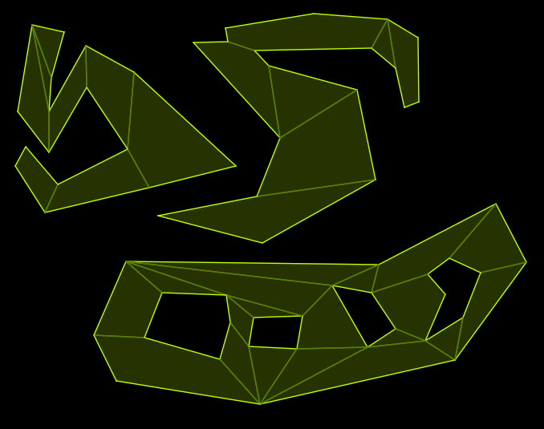

# Give Up GitHub

This project has given up GitHub.  ([See Software Freedom Conservancy's *Give Up  GitHub* site for details](https://GiveUpGitHub.org).)

You can now find this project at [https://codeberg.org/apicici/pathfun](https://codeberg.org/apicici/pathfun) instead.

Any use of this project's code by GitHub Copilot, past or present, is done without our permission.  We do not consent to GitHub's use of this project's code in Copilot.

Join us; you can [give up GitHub](https://GiveUpGitHub.org) too!


# pathfun

Pure Lua library for 2D pathfinding based using a polygonal mesh, written in [MoonScript](https://moonscript.org/).

The function to compute the shortest path between two points is adapted from the `Navigation2D::get_simple_path` method from the [Godot Engine](https://godotengine.org/).

## Features
- Supports navigation areas made up of disjoint pieces and/or with holes.
- Supports dynamically hiding/unhiding parts of the navigation area to add/	remove obstacles or disconnect/connect regions.
- Uses integer coordinates to make calculations exact and avoid problems with floating point precision

An example of the library in use can be seen in the following image:



## How to use

The git repository only contains the MoonScript source code. To get the Lua library you can download a [release](https://github.com/apicici/pathfun/releases) or compile the files in the `src` directory with MoonScript yourself (see instructions [here](https://leafo.net/posts/getting_started_with_moonscript.html#creating-programs/compiling-and-running)).

Documentation in html format for the library can be found:

- online at https://apicici.github.io/pathfun
- in the `docs` folder of the repository (main branch)
- in the `docs` folder of a release

### Navigation area data

The library expects as input a list of polygonal maps when initialising the navigation area.
Each polygon map is itself a table of convex polygons (represented by a list of pairs of coordinates), which provides a convex decomposition of a region of space (disjoint pieces and holes are allowed).

An visual editor for the navigation area which exports the appropriate data can be found [here](https://github.com/apicici/pathfun-editor).

## Example code

```lua
local pathfun = require "pathfun"

-- In this example the first polygon map describes two disjoint polygons, while the
-- second one is a (currently hidden) bridge between them.
local polygon_maps = {
    {
        {{520,441},{456,429},{454,342},{658,370},{666,436}},
        {{520,441},{666,436},{549,498}},
        {{822,391},{880,372},{868,446},{747,431}},
        {{822,391},{747,431},{754,360},{796,346}}
    },
    {
        {{747,431},{666,436},{658,370},{754,360}},
        hidden = true,
        name = "bridge"
    }
}

local navigation = pathfun.Navigation(polygon_maps)

-- optional, only needed if to force initialisation right now
navigation:initialize()

-- returns false since the point is in the hidden polygon map
navigation:is_point_inside(706, 401)

-- returns {{564,467}, {665,436}} since the bridge is hidden
navigation:shortest_path(564, 467, 856, 437)

-- make the bridge visible
navigation:toggle_visibility("bridge")

-- now returns true
navigation:is_point_inside(706, 401)

-- returns {{564,467}, {665,436}, {747, 431}, {856, 437}}
navigation:shortest_path(564, 467, 856, 437)
```
